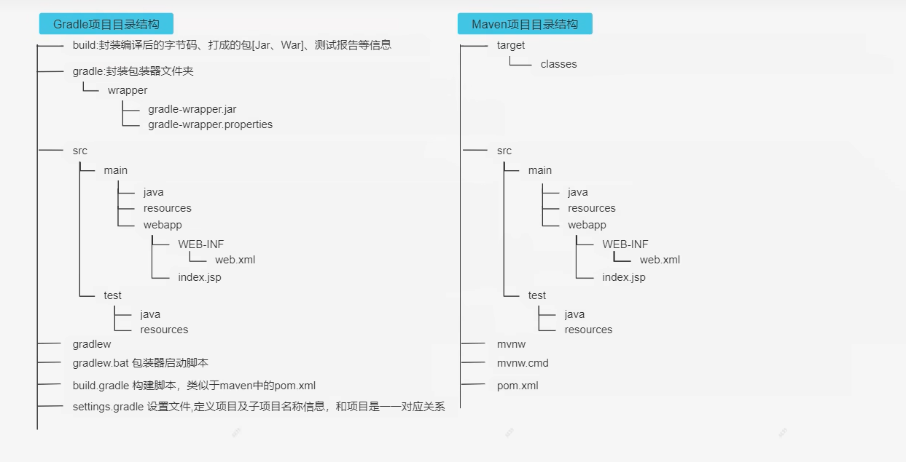
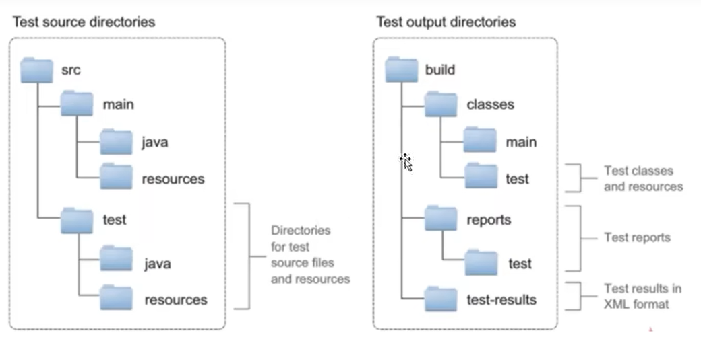
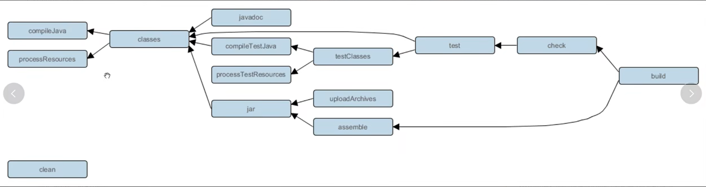
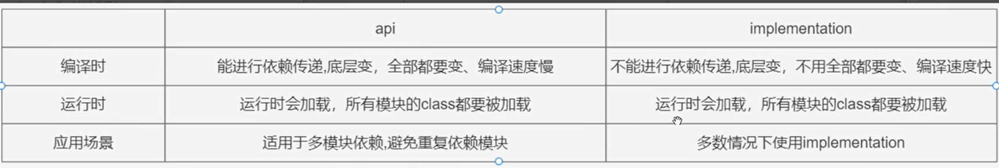
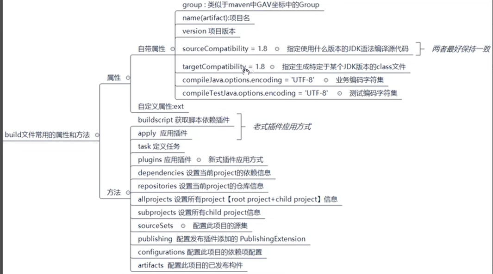
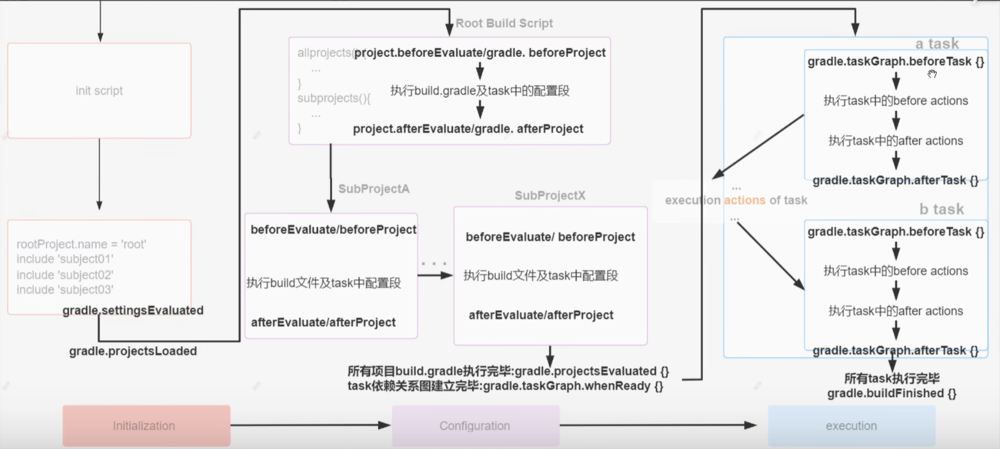

### gradle项目目录结构

### gradle wrapper项目执行流程
1. 第一次执行时，./gradlew build命令会读取gradle-wrapper.properties文件的配置信息;
2. 下载gradle，并把压缩包和解压后的文件存放在GRADLE_USER_HOME目录下的wrapper/dists目录中;
3. 在GRADLE_USER_HOME目录下的caches目录构建缓存,以后相同的gradle版本就不用下载了;
4. 之后执行的./gradle所有命令都是使用指定的gradle版本;

## gradle
### 默认测试目录
 
### 任务依赖
1. 重复依赖的任务只执行一次
2. 三种写法
3. gradle的任务指令都是基于任务完成的
### gradle指令
- 见云文档
### gradle指令之间的依赖

### 定义任务的方法
- 通过properties的task()方法
- 通过task对象的create方法或者register方法
- 注：创建任务时可以指定task属性（group、description...）
### 任务的类型（官网给定了一些任务类型）
### 文件操作
### gradle依赖方式
1. 本地依赖：implemention file('lib/log4j.jar')、implemention fileTree('dir':'lib')
2. 项目依赖（需要在settings.gradle中引入）：implemention project(':subject01')
3. 直接依赖：implemention group: '...', name: '...', version: '...'
### gradle依赖类型
#### java插件
1. compileOnly：只在编译时需要，打包时不需要
2. runtimeOnly：只在运行时有效，在编译时不需要，比如mysql驱动
3. implementation：运行、编译、打包时都有效
4. testCompileOnly：测试编译时有效
5. testRuntimeOnly：测试运行时有效
6. testImplementation：测试运行、编译时有效
#### java-library插件
1. api
2. compileOnlyApi
#### 区别

- 多模块项目构建使用优先使用api，其他情况建议使用implementation
### gradle依赖冲突
- 默认使用新版本的jar包
- 可以使用exclude排除，implementation ... { exclude group: '...' }
- 设置禁止依赖传递（不推荐）
- 强制使用指定版本：implementation 'org.slf4j:slf4j-api:1.4.0!!' 
                或者implementation 'org.slf4j:slf4j-api:1.4.0' { version strictly('1.4.0') }
                或者 implementation 'org.slf4j:slf4j-api:1.4.0+' （动态版本声明）
                或者implementation 'org.slf4j:slf4j-api:latest.integration'（动态版本声明）
- 配置jar包冲突build失败：configuration.all() { ... }
### gradle 插件
#### 插件的作用
1. 拓展task任务
2. 添加依赖配置到项目中
3. 可以向项目中拓展新的扩展属性、方法等
4. 可以对项目进行约束
#### 插件的分类
1. 脚本插件：apply from: 'version.gradle'，然后通过task任务使用脚本文件
2. 二进制插件： 
    - 内部插件：plugins DSL方式、apply plugin: 插件id or 插件的全类 or 插件的简类名、apply { plugin: }
    - 第三方插件：传统使用方式（buildscript{ ... }）、plugins DSL的方式，可参考 www.plugins.gradle.org
    - 自定义插件：使用class定义插件并实现Plugin接口
#### 发布插件到 maven 仓库
#### 插件的使用

### build.gradle 文件
#### 基本介绍
1. 支持java、groovy等语言
2. build.gradle 文件是程序构建的入口，可以配置版本、插件、依赖库等信息
3. 父工程可以对子工程进行统一配置 

#### gradle build 生命周期

### 在 springboot 中使用gradle
